<!-- vscode-markdown-toc -->
* 1. [设计目的](#)
* 2. [功能](#-1)
	* 2.1. [ T_TO_JSON](#T_TO_JSON)
	* 2.2. [JSON_TO_T](#JSON_TO_T)
	* 2.3. [AddField](#AddField)
	* 2.4. [UpdateField](#UpdateField)
	* 2.5. [DeleteField](#DeleteField)
* 3. [搜索与层级分隔符](#-1)
	* 3.1. [概念](#-1)
		* 3.1.1. [层级](#-1)
		* 3.1.2. [层级分隔符 -](#-)
		* 3.1.3. [转义 #](#-1)
	* 3.2. [工具](#-1)
		* 3.2.1. [analyticalSeparator](#analyticalSeparator)
		* 3.2.2. [generationSeparator](#generationSeparator)
	* 3.3. [注意](#-1)
		* 3.3.1. [上述接口的fieldName都支持使用层级分隔符来定位](#fieldName)
* 4. [支持的平台](#-1)
	* 4.1. [Win64](#Win64)
* 5. [尚未解决的问题](#-1)
* 6. [依赖](#-1)

<!-- vscode-markdown-toc-config
	numbering=true
	autoSave=true
	/vscode-markdown-toc-config -->
<!-- /vscode-markdown-toc -->

##  1. <a name=''></a>设计目的
为UE4.26提供蓝图json工具，方便的在任意蓝图类型和json字符串之间进行转换
##  2. <a name='-1'></a>功能
###  2.1. <a name='T_TO_JSON'></a> T_TO_JSON
|参数|参数解释|描述|
|:-:|:-:|:-:|
|T|输入任意蓝图类型|蓝图中能用的都能用（能被反射的才能用）|
|FString& json|输出json字符串|json不会输出注释|
|bool& success|是否成功|成功才返回字符串|
|FString& info|附加信息|如果失败，则附加信息会说明失败原因|
|int32 depth = 10|展开深度|可能会存在耦合形成闭环的情况，将会导致无限展开，因此设置展开深度，遍历节点的过程中，当某节点达到深度后，该节点不再展开解析|

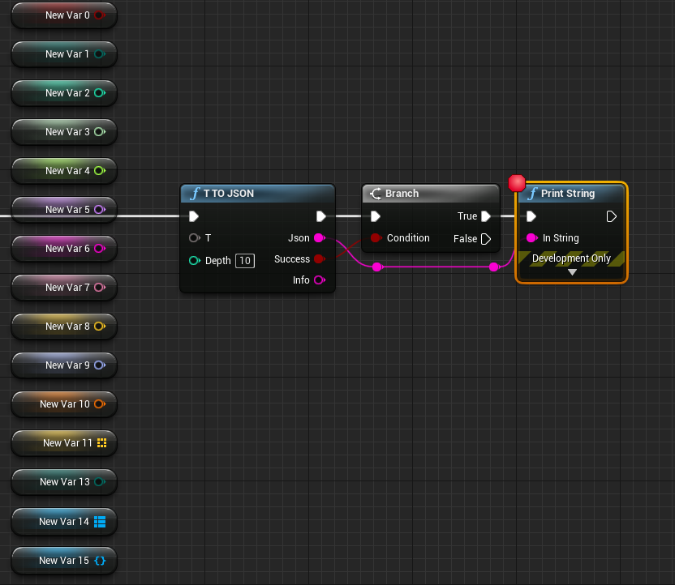
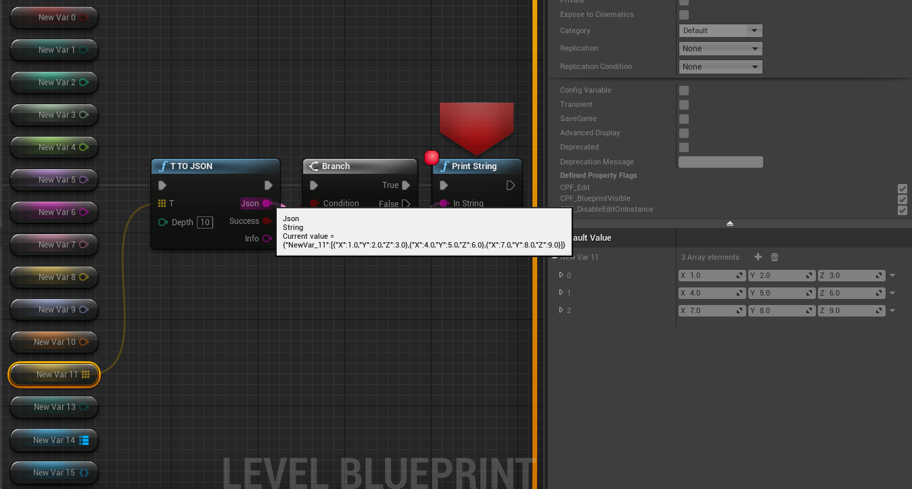
###  2.2. <a name='JSON_TO_T'></a>JSON_TO_T
|参数|参数解释|描述|
|:-:|:-:|:-:|
|const FString& json|输入json字符串|不支持注释|
|FString fieldName|json字段名|若为空，则全部生成，若不为空，则查找该字段对应的值生成|
|int32& T|输出任意蓝图类型|以提供的蓝图类型作为模板，搜索json字符串进行赋值|
|bool& success|是否成功|成功才生成|
|FString& info|附加信息|如果失败，则附加信息会说明失败原因|
|int32 depth = 10|展开深度|可能会存在耦合形成闭环的情况，将会导致无限展开，因此设置展开深度，遍历节点的过程中，当某节点达到深度后，该节点不再展开解析|

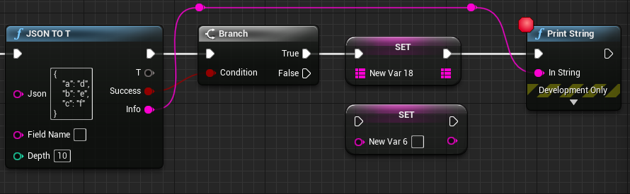
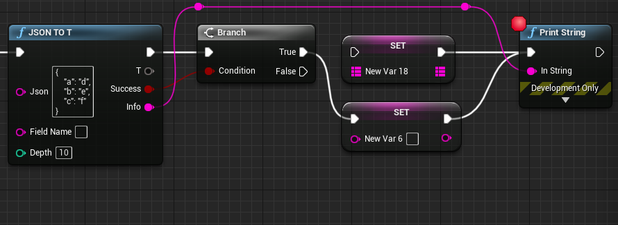
###  2.3. <a name='AddField'></a>AddField
|参数|参数解释|描述|
|:-:|:-:|:-:|
|const FString& json|输入json字符串|不支持注释|
|const FString& fieldName|新增的json字段名|字段名|
|const int32& T|蓝图任意类型|作为新增字段的值|
|bool& success|是否成功|成功才生成|
|FString& info|附加信息|如果失败，则附加信息会说明失败原因|
|FString& result|输出json字符串|新增字段后的json字符串|
|int32 depth = 10|展开深度|可能会存在耦合形成闭环的情况，将会导致无限展开，因此设置展开深度，遍历节点的过程中，当某节点达到深度后，该节点不再展开解析|

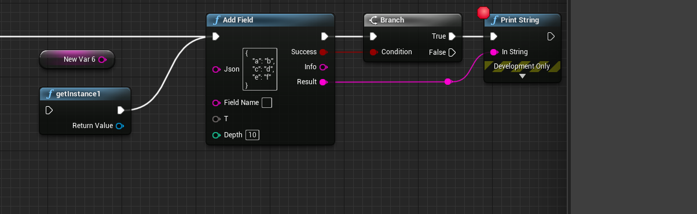
```cpp
UCLASS()
class TESTJSON_API UMyObject1 : public UObject
{
	GENERATED_BODY()

public:

	UFUNCTION(BlueprintCallable, meta = (DisplayName = "getInstance1", Keywords = "getInstance1"), Category = "MyObject1")
		static UMyObject1* getInstance1();

	UMyObject1();

	UPROPERTY()
		bool v3;

	UPROPERTY()
		FString v4;
};

```
```cpp
UMyObject1::UMyObject1()
{
	v3 = true;
	v4 = "hello world";
}
```
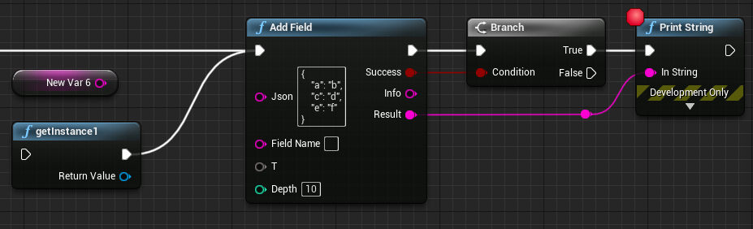
###  2.4. <a name='UpdateField'></a>UpdateField
|参数|参数解释|描述|
|:-:|:-:|:-:|
|const FString& json|输入json字符串|不支持注释|
|const FString& fieldName|更新的json字段名|字段名|
|const int32& T|蓝图任意类型|作为新增字段的值|
|bool& success|是否成功|成功才生成|
|FString& info|附加信息|如果失败，则附加信息会说明失败原因|
|FString& result|输出json字符串|更新字段后的json字符串|
|int32 depth = 10|展开深度|可能会存在耦合形成闭环的情况，将会导致无限展开，因此设置展开深度，遍历节点的过程中，当某节点达到深度后，该节点不再展开解析|

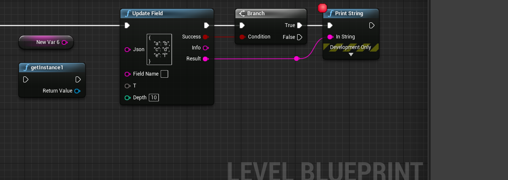
```cpp
UCLASS()
class TESTJSON_API UMyObject1 : public UObject
{
	GENERATED_BODY()

public:

	UFUNCTION(BlueprintCallable, meta = (DisplayName = "getInstance1", Keywords = "getInstance1"), Category = "MyObject1")
		static UMyObject1* getInstance1();

	UMyObject1();

	UPROPERTY()
		bool v3;

	UPROPERTY()
		FString v4;
};

```
```cpp
UMyObject1::UMyObject1()
{
	v3 = true;
	v4 = "hello world";
}
```
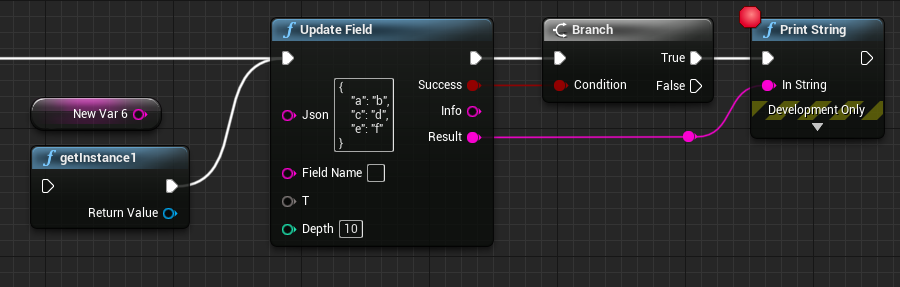
###  2.5. <a name='DeleteField'></a>DeleteField
|参数|参数解释|描述|
|:-:|:-:|:-:|
|const FString& json|输入json字符串|不支持注释|
|const FString& fieldName|删除的json字段名|字段名|
|bool& success|是否成功|成功才生成|
|FString& info|附加信息|如果失败，则附加信息会说明失败原因|
|FString& result|输出json字符串|删除字段后的json字符串|

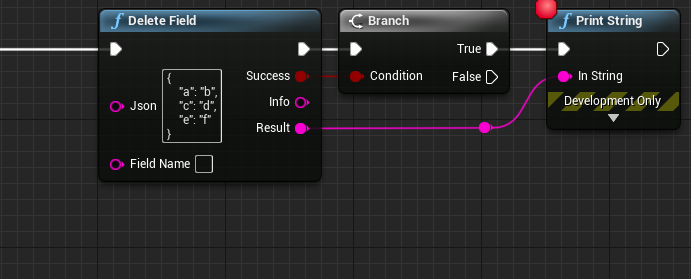
##  3. <a name='-1'></a>搜索与层级分隔符
###  3.1. <a name='-1'></a>概念
在遍历JSON结构的时候，某一个键值对的值有两种情况会让层级增加，object和array
####  3.1.1. <a name='-1'></a>层级
很显然这种情况就属于有多层级的情况，因此在json操作中，就需要明确层级的概念，以定位到具体的某一个键值对，规定：键值对的值的类型为数组或JSON对象，那么层级+1
```cpp
{
    "姓名": "铁蛋",
    "年龄": 18,
    "家庭成员": [
        {
            "姓名": "铁蛋老爹",
            "年龄": 42
        },
        {
            "姓名": "铁蛋老妈",
            "年龄": 42
        },
        {
            "姓名": "铁蛋弟弟",
            "年龄": 15
        }
    ]
}
```
####  3.1.2. <a name='-'></a>层级分隔符 -
很显然如果我们想定位到铁蛋弟弟的年龄，那么就需要层级分隔符在遍历过程中来作为进入一个层级的标志
我们用这样的字符串，就可以精确的定位到铁蛋弟弟的年龄了，很显然，只需要加一个减号
```cpp
"家庭成员-2-年龄"
```
####  3.1.3. <a name='-1'></a>转义 #
这时候就会存在一个问题，如果键值本身存在减号，那么路径分隔符就会产生歧义
因此我们提供#作为转义
|符号|转义后的含义|
|:-:|:-:|
|##|#|
|#-|-|

此时若想定位到铁蛋老妈的年龄
```cpp
{
    "姓名": "铁蛋",
    "年龄": 18,
    "家庭成员": [
        {
            "姓名": "铁蛋老爹",
            "年龄": 42
        },
        {
            "姓名": "铁蛋老妈",
            "-#年龄": 42
        },
        {
            "姓名": "铁蛋弟弟",
            "#-#-##--##--年龄-#-#": 15
        }
    ]
}
```
只要这样写就可以了，在转义的作用下，分隔符并不会产生歧义
```cpp
"家庭成员-1-#-##年龄"
```
如果像定位弟弟的年龄，稍微复杂一点点
```cpp
"家庭成员-2-###-###-#####-#-#####-#-年龄#-###-##"
```
###  3.2. <a name='-1'></a>工具
可能你想说，这样的转义难以理解，也容易拼错，那么这里提供两个工具
####  3.2.1. <a name='analyticalSeparator'></a>analyticalSeparator
|参数|参数解释|
|:-:|:-:|
|const FString& fieldName|要操作的字段名，支持层级分隔符|
|TArray<FString>& fieldNameArray|根据层级分隔符切分|
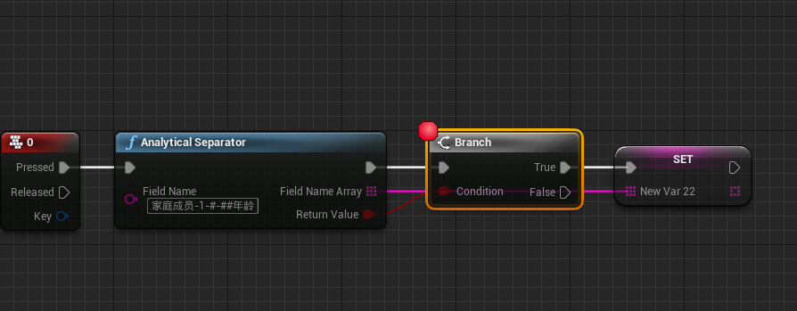
####  3.2.2. <a name='generationSeparator'></a>generationSeparator
|参数|参数解释|
|:-:|:-:|
|const TArray<FString>& fieldNameArra|每一层的键|
|FString& fieldName|根据层级分隔符拼接后的完整字段名|
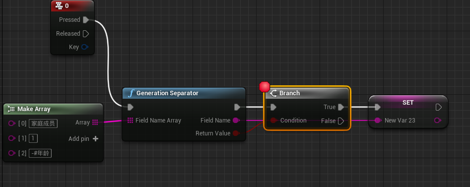
###  3.3. <a name='-1'></a>注意
####  3.3.1. <a name='fieldName'></a>上述接口的fieldName都支持使用层级分隔符来定位
##  4. <a name='-1'></a>支持的平台
###  4.1. <a name='Win64'></a>Win64
##  5. <a name='-1'></a>尚未解决的问题
[**问题**](./markdown/issues/issues.md)
##  6. <a name='-1'></a>依赖
json的相关操作依赖一个好用的开源库 [**nlohmann/json**](https://github.com/nlohmann/json)
