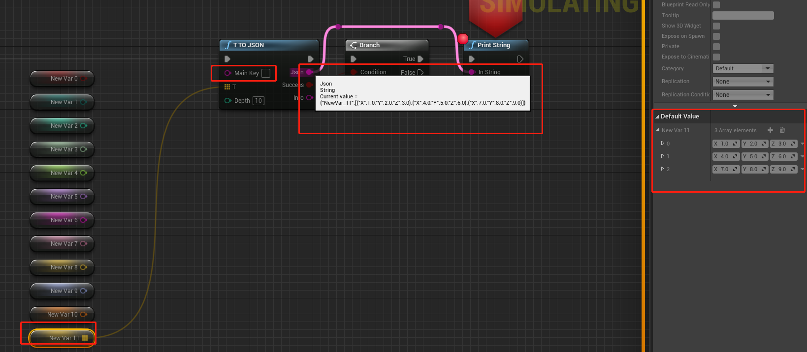

<!-- vscode-markdown-toc -->
* 1. [设计目的](#)
* 2. [功能](#-1)
	* 2.1. [ T_TO_JSON](#T_TO_JSON)
	* 2.2. [JSON_TO_T](#JSON_TO_T)
	* 2.3. [AddField](#AddField)
	* 2.4. [UpdateField](#UpdateField)
	* 2.5. [DeleteField](#DeleteField)
* 3. [支持的平台](#-1)
	* 3.1. [Win64](#Win64)
* 4. [尚未解决的问题](#-1)
* 5. [依赖](#-1)

<!-- vscode-markdown-toc-config
	numbering=true
	autoSave=true
	/vscode-markdown-toc-config -->
<!-- /vscode-markdown-toc -->

##  1. <a name=''></a>设计目的
为UE4.26提供蓝图json工具，方便的在任意蓝图类型和json字符串之间进行转换
##  2. <a name='-1'></a>功能
###  2.1. <a name='T_TO_JSON'></a> T_TO_JSON
|参数|参数解释|描述|
|:-:|:-:|:-:|
|T|输入任意蓝图类型|蓝图中能用的都能用（能被反射的才能用）|
|FString& json|输出json字符串|json不会输出注释|
|bool& success|是否成功|成功才返回字符串|
|FString& info|附加信息|如果失败，则附加信息会说明失败原因|
|int32 depth = 10|展开深度|可能会存在耦合形成闭环的情况，将会导致无限展开，因此设置展开深度，遍历节点的过程中，当某节点达到深度后，该节点不再展开解析|



###  2.2. <a name='JSON_TO_T'></a>JSON_TO_T
|参数|参数解释|描述|
|:-:|:-:|:-:|
|const FString& json|输入json字符串|不支持注释|
|FString fieldName|json字段名|若为空，则全部生成，若不为空，则查找该字段对应的值生成|
|int32& T|输出任意蓝图类型|以提供的蓝图类型作为模板，搜索json字符串进行赋值|
|bool& success|是否成功|成功才生成|
|FString& info|附加信息|如果失败，则附加信息会说明失败原因|
|int32 depth = 10|展开深度|可能会存在耦合形成闭环的情况，将会导致无限展开，因此设置展开深度，遍历节点的过程中，当某节点达到深度后，该节点不再展开解析|


###  2.3. <a name='AddField'></a>AddField
|参数|参数解释|描述|
|:-:|:-:|:-:|
|const FString& json|输入json字符串|不支持注释|
|const FString& fieldName|新增的json字段名|字段名|
|const int32& T|蓝图任意类型|作为新增字段的值|
|bool& success|是否成功|成功才生成|
|FString& info|附加信息|如果失败，则附加信息会说明失败原因|
|FString& result|输出json字符串|新增字段后的json字符串|
|int32 depth = 10|展开深度|可能会存在耦合形成闭环的情况，将会导致无限展开，因此设置展开深度，遍历节点的过程中，当某节点达到深度后，该节点不再展开解析|


```cpp
UCLASS()
class TESTJSON_API UMyObject1 : public UObject
{
	GENERATED_BODY()

public:

	UFUNCTION(BlueprintCallable, meta = (DisplayName = "getInstance1", Keywords = "getInstance1"), Category = "MyObject1")
		static UMyObject1* getInstance1();

	UMyObject1();

	UPROPERTY()
		bool v3;

	UPROPERTY()
		FString v4;
};

```
```cpp
UMyObject1::UMyObject1()
{
	v3 = true;
	v4 = "hello world";
}
```

###  2.4. <a name='UpdateField'></a>UpdateField
|参数|参数解释|描述|
|:-:|:-:|:-:|
|const FString& json|输入json字符串|不支持注释|
|const FString& fieldName|更新的json字段名|字段名|
|const int32& T|蓝图任意类型|作为新增字段的值|
|bool& success|是否成功|成功才生成|
|FString& info|附加信息|如果失败，则附加信息会说明失败原因|
|FString& result|输出json字符串|更新字段后的json字符串|
|int32 depth = 10|展开深度|可能会存在耦合形成闭环的情况，将会导致无限展开，因此设置展开深度，遍历节点的过程中，当某节点达到深度后，该节点不再展开解析|


```cpp
UCLASS()
class TESTJSON_API UMyObject1 : public UObject
{
	GENERATED_BODY()

public:

	UFUNCTION(BlueprintCallable, meta = (DisplayName = "getInstance1", Keywords = "getInstance1"), Category = "MyObject1")
		static UMyObject1* getInstance1();

	UMyObject1();

	UPROPERTY()
		bool v3;

	UPROPERTY()
		FString v4;
};

```
```cpp
UMyObject1::UMyObject1()
{
	v3 = true;
	v4 = "hello world";
}
```

###  2.5. <a name='DeleteField'></a>DeleteField
|参数|参数解释|描述|
|:-:|:-:|:-:|
|const FString& json|输入json字符串|不支持注释|
|const FString& fieldName|删除的json字段名|字段名|
|bool& success|是否成功|成功才生成|
|FString& info|附加信息|如果失败，则附加信息会说明失败原因|
|FString& result|输出json字符串|删除字段后的json字符串|


##  3. <a name='-1'></a>支持的平台
###  3.1. <a name='Win64'></a>Win64
##  4. <a name='-1'></a>尚未解决的问题
[**问题**](./markdown/issues/issues.md)
##  5. <a name='-1'></a>依赖
json的相关操作依赖一个好用的开源库 [**nlohmann/json**](https://github.com/nlohmann/json)
